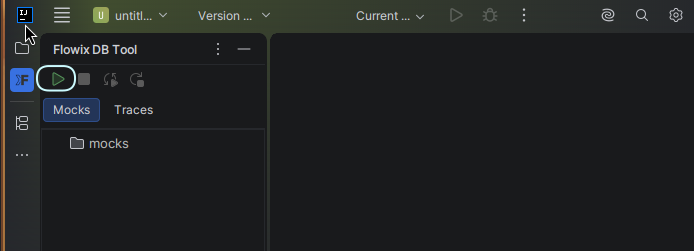
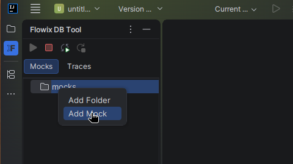
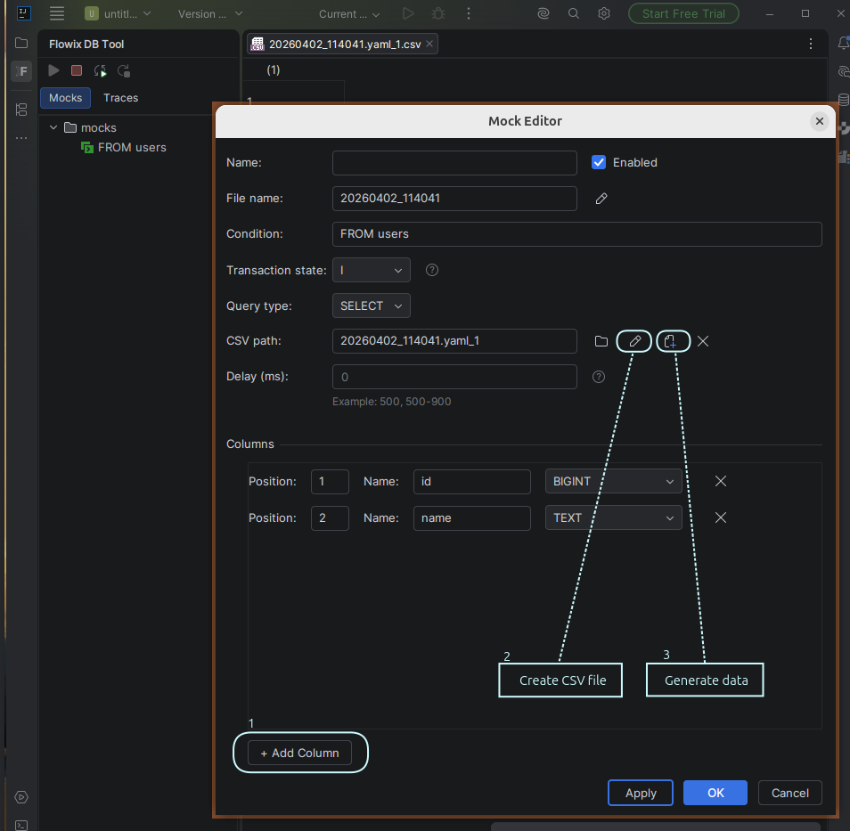
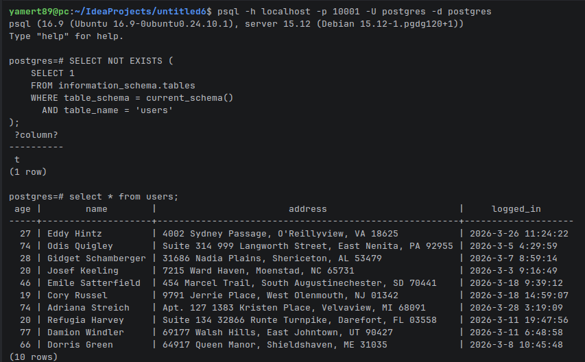
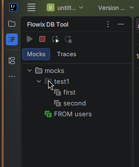
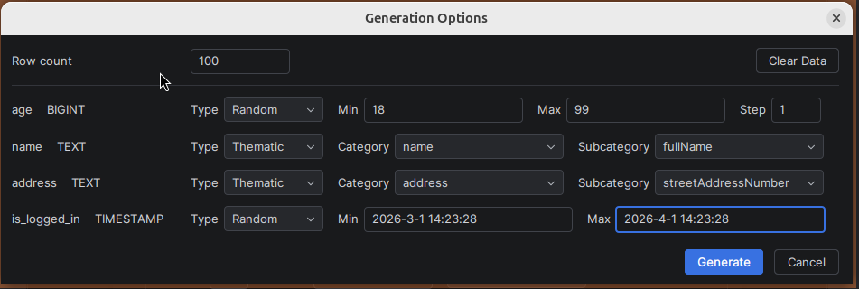
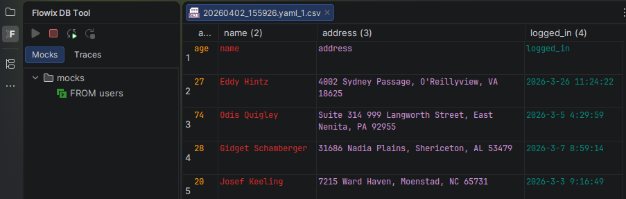

# Flowix DB Tool - Getting Started Guide

Welcome to Flowix DB Tool! This guide will help you get up and running with the plugin quickly.

## Table of Contents

1. [First Launch & Configuration](#first-launch--configuration)
2. [Starting the Server](#starting-the-server)
3. [Creating Your First Mock](#creating-your-first-mock)
4. [Check Interception Result](#check-interception-result)
5. [SQL Pattern Matching](#sql-pattern-matching)
6. [Enable/Disable](#enable-disable)
7. [Data Generation](#data-generation)
8. [SQL Tracing](#sql-tracing)
9. [File Locations](#file-locations)

---

## First Launch & Configuration

After installing the plugin and opening a project, Flowix DB Tool automatically initializes itself.

### Accessing the Tool Window

The Flowix DB Tool window appears on the left side of your IDE. If you don't see it:

1. Go to **View** → **Tool Windows** → **Flowix DB Tool**
2. Or use the sidebar icon

### Initial Configuration

On first launch, Flowix creates a configuration file at `.flowix/flowix.yaml` in your project root:

```yaml
database:                   
  host: "localhost"         # PostgreSQL host          
  port: 5432                # PostgreSQL port   

flowix:
  localPort: 10001          # Port for the Flowix backend         
  managePort: 7777          # Port for communication between IDE plugin and backend
  autonomousMode: false     # Run Flowix without a real database; all data must be provided via mocks (experimental)
  logLevel: INFO            # Log level for the backend process (FINEST, INFO, SEVERE, OFF)
  tracing:
    filters: []             # SQL query filters. Only queries containing these values will be intercepted.
```

---

## Starting the Server

Before you can use mocks, you need to start the Flowix server.

### Using the Toolbar

1. Open the **Flowix DB Tool** window
2. Click the **▶ Run Server** button in the toolbar



---

## Creating Your First Mock

A **mock** defines how Flowix responds to specific SQL queries.

### Creating a New Mock

1. Make sure the server is running
2. In the **Mocks** tab, right-click on a folder (or the root "mocks" folder)
3. Select **Add Mock**



### Mock Editor Fields

The Mock Editor dialog opens when you double-click a mock.

### Adding Columns

For `SELECT` queries, define the result columns:

1. Click **+ Add Column**
2. For each column, specify:
   - **Position**: Column position
   - **Name**: Column name as returned to the application
   - **Type**: PostgreSQL data type (OID)
   - **Length**: Field length
   - **Precision**: For numeric types (total digits)
   - **Scale**: For numeric types (decimal digits)

Then create a new CSV file and fill it with test data (see [Data Generation](#data-generation)).



### Saving the Mock

Click **OK** to save your mock. The mock file is stored in the `.flowix/mocks/` directory.
For quick access to the CSV file, click 

---

## Check Interception Result

Now we can verify that our mock is working. Connect to the proxy, confirm that the "users" table does not exist, and run a query. 



---

## SQL Pattern Matching

The **Condition** field determines which SQL queries your mock intercepts. Flowix uses **substring matching**.

### How Matching Works

When your application sends a query, Flowix checks whether the query **contains** the condition string (case-sensitive).

```sql
-- Your application sends:
SELECT * FROM users WHERE id = 123

-- Mock condition:
FROM users

-- Result: MATCH! The mock responds.
```

### Best Practices

1. **Be specific enough**: `SELECT` matches too many queries
2. **Test your patterns**: Use [SQL Tracing](#sql-tracing) to inspect queries sent by your app

---

## Enable/Disable

- Click the icon next to a mock or folder to toggle it on/off
- Disabled mocks are ignored by the server
- Disabling a folder turns off all contained mocks



---

## Data Generation

Flowix can automatically generate realistic test data for your mocks instead of manually creating CSV files.

### When to Use Data Generation

- Creating large datasets for performance testing
- Generating varied data for edge case testing
- Quickly populating mocks without manual CSV editing

### Opening Data Generation

1. Create or edit a mock with columns defined
2. Look for the **Generate Data** option (in the mock context menu or editor)




### Generating Data

1. Set the **Row count**
2. Configure each column's generation options
3. Click **Generate**
4. The data is saved as a CSV file linked to your mock



---

## SQL Tracing

Tracing captures SQL queries sent by your application, helping you understand what queries to mock.

### Starting Trace Capture

1. Start the Flowix server
2. Click the **Start Tracing** button in the toolbar

### Viewing Captured Queries

Switch to the **Traces** tab to see intercepted queries:

Each trace is a read-only mock. You can manually copy it to the mocks folder using the Project Tree.

> Tracing works only for real queries, not proxied ones.

### Using Trace Filters

Configure filters in `flowix.yaml` to capture only specific queries:

```yaml
flowix:
  tracing:
    filters:
      - "FROM users"
      - "INSERT INTO"
```

---

## File Locations

| File/Directory | Location | Purpose |
|----------------|----------|---------|
| Configuration | `.flowix/flowix.yaml` | Main settings |
| Mocks | `.flowix/mocks/` | Mock definitions with CSV files |
| Traces | `.flowix/traces/` | Captured queries (if persisted) |
